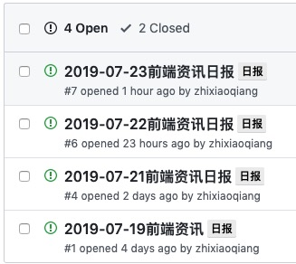

# fed-news-push

## 简介

每天定时推送前端资讯到钉钉、github-issues、小程序云数据库，数据来源主要是 github trending, 后续会接入更多的优质源，接下来将会分多期进行详细讲解

#### 可以提前了解下我的另外两篇

[资讯推送(一)-分析](http://note.youdao.com/noteshare?id=070717284fdb7c10ae9ce8e97bececdc)(包含使用到的各种技术)

[Taro + rematch 云开发](http://note.youdao.com/noteshare?id=9dcc02bcb0ac4c0d350d7d8fd20a1a8a)

#### 特性

- [x] 小程序提供 GitHub-trending 列表查询
- [x] 每天 x 点将数据处理后要推送的列表
- [x] 钉钉群在工作日早上 x 点收到推送
- [x] issues 在工作日早上 x 点添加一条 issue 日报

#### 更多特性

- [ ] 添加数据获取源头(掘金等)
- [ ] 小程序提供 GitHub-trending 详情展示
- [ ] 小程序提供推送消息的增删改查、可选择性推送
- [ ] 添加周报的推送

- [ ] ......

## 目录结构

```bash
├── README.md
├── api
│   ├── dingTalk.js # 钉钉推送
│   ├── github # github各类操作
│   │   └── index.js
│   ├── index.js # 节假日、trendingList 等
│   └── wxClounFun.js # 微信云开发调用、token获取
├── config
│   └── index.json # github token、wx config、dingTalk robot Url...
├── package.json
├── start.js
├── utils
│   ├── index.js
│   ├── request.js
│   └── schedule.js
└── yarn.lock
```

#### tree 输出文件目录结构

```bash
#mac 系统
brew install tree

# npm || yarn
npm i ctree-cli -g
yarn add ctree-cli global
```

## 效果图

#### 小程序 trending


#### [issues](https://github.com/zhixiaoqiang/fed-news-push/issues)



#### 钉钉


